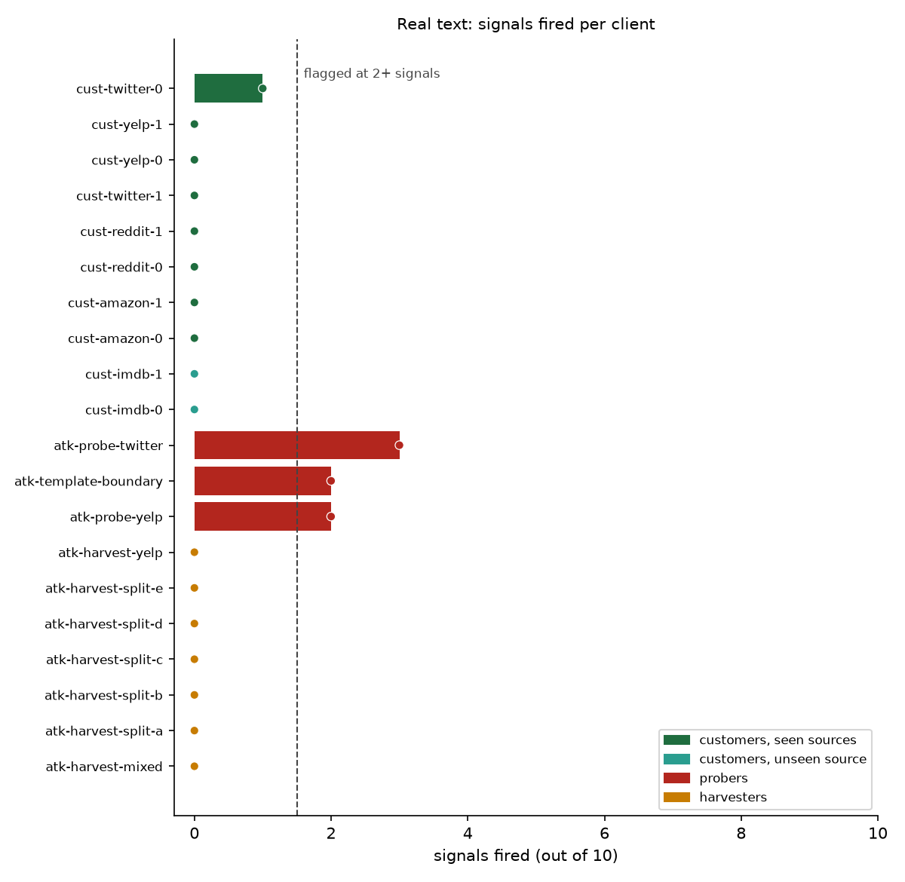
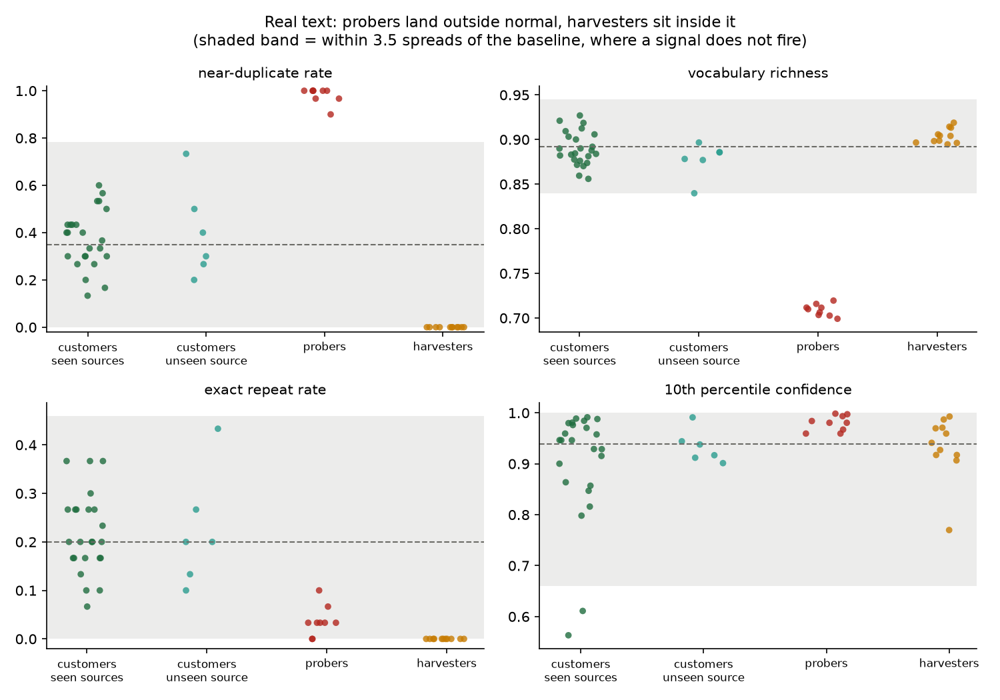
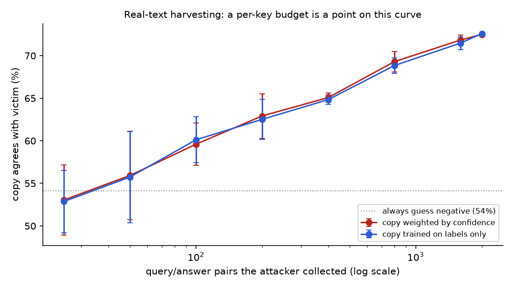
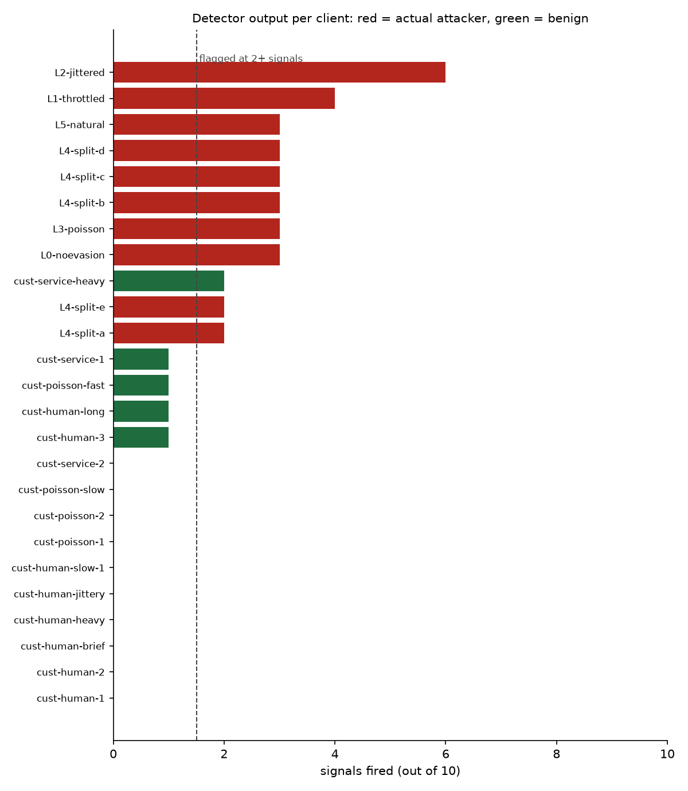
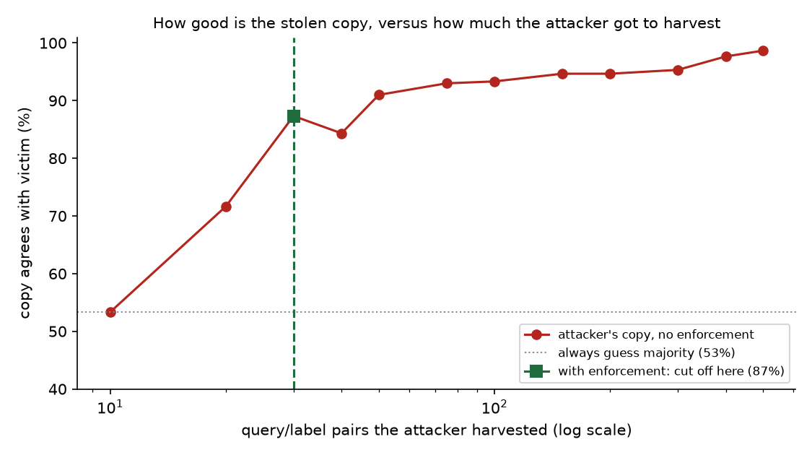

# Extraction Detector

[](https://github.com/adwaitm0106/extraction-detector/actions/workflows/tests.yml)

Catching people who try to steal your ML model by asking it a lot of questions.

## What this is about

If you sell access to a model through an API, someone can copy it without ever
breaking in. They just use it. They send inputs, save the answers, and train
their own model on those pairs. At the end they have a decent copy of the thing
you paid to build, and your logs show nothing but a customer using the product.

Most people defend against this with rate limits. That works fine if the
attacker is in a hurry. It does nothing if they're patient. Someone sending one
query a second looks exactly like a normal customer, and in a week they have
plenty of data.

So this project doesn't look at how *much* someone queries. It looks at *what*
they ask. Copying a model means covering the input space in an organised way,
and organised queries look different from real ones. Different vocabulary,
more repetition, more queries sitting right on the edge where the model can't
decide. Those patterns don't go away when you slow down.

And it doesn't stop at noticing. Once a key is flagged, the API starts
answering it with HTTP 429 and the attacker's harvest stops.

**Who'd use this:** a team running a paid inference API. Sentiment,
moderation, classification, anything sold per call.

**What it costs to get wrong:** if you wrongly flag a real customer, they get
throttled or cut off, and that's a support ticket and maybe a lost account. So
the detector never just says "attacker". It prints which signals fired, how far
off normal they were, and a plain-English reason for each one. And it won't
flag anyone on a single signal alone.

## At a glance

- **It catches attackers who probe the model.** On real text from five public
  datasets it caught every boundary-probing attacker (3 of 3) and wrongly
  flagged none of 10 real customers, including two sending a kind of text it
  had never seen.
- **It can't catch passive harvesting, and the repo shows why.** A harvester
  sending ordinary text looks statistically the same as a real customer, so 0
  of 7 harvesting keys were caught.
- **So two defences were added and measured.** Hiding the model's confidence
  made no difference, because this model is almost always sure of itself. A
  query budget of 50 per key held a one-key harvester's stolen copy to 55.9%
  agreement, barely above guessing, but with 20 keys it climbed back to 69.7%.
- **Everything is reproducible.** One command rebuilds the data, one reruns each
  experiment, and 52 tests run on every push.

## What's in here

```
api/        the "victim" API - a sentiment model that logs every request,
            with optional confidence hiding and per-key query budgets
traffic/    fake traffic: normal customers and several kinds of attacker
detector/   detection - features, calibration, scoring, enforcement, dashboard
eval/       measuring the detector, the stolen-copy experiment, and the charts
demo/       one script that runs the whole story end to end, plus a
            stage-by-stage walkthrough of what it prints
tests/      the automated test suite, run on every push by GitHub Actions
```

## Run it yourself

You need Python 3.11 or newer and about 10 minutes, most of it downloading the
model.

**Everything below assumes you're inside the `extraction-detector` folder.**
All the paths are relative. If you run these from the parent folder you'll get
confusing errors like `No module named 'api'` or `No baseline at
thresholds.json`. The real problem is just that you're in the wrong directory.

### Setup

```bash
git clone https://github.com/adwaitm0106/extraction-detector.git
cd extraction-detector
python -m venv .venv
```

Install (about 250 MB, CPU-only PyTorch):

```bash
.venv/Scripts/python.exe -m pip install -r api/requirements.txt
```

On Mac or Linux, swap `.venv/Scripts/python.exe` for `.venv/bin/python`
everywhere in this README.

### The fastest way to see it work

One command runs the whole thing. It starts the API, learns what normal looks
like, sends benign traffic, then sends an attacker, alerts on it live, and cuts
it off:

```powershell
powershell -ExecutionPolicy Bypass -File demo\run_demo.ps1
```

Takes a little under 3 minutes the first time. There's a `demo/run_demo.sh`
for Mac and Linux. It cleans up after itself, including if you hit Ctrl+C.

**What you should see:**

1. `API ready: model_loaded=true` means the model has loaded
2. A calibration phase with four fake customers. This is the detector learning
   what normal traffic looks like
3. **PHASE 1** in green: normal customers querying. You should see
   `30 requests scored - all clean` and **no alerts**
4. **PHASE 2** in red: the attacker starts. About 20 seconds later a red
   `[ALERT] EXTRACTION SUSPECTED` line appears with the signals that fired and
   a `why:` line explaining them, then a yellow `[BLOCK]` line
5. The attacker's own tally, something like `status codes: {200: 37, 429: 23}`.
   The 200s got through before the block, the 429s didn't
6. A results table, then everything shuts down

If Phase 1 stays quiet and Phase 2 alerts and blocks, it's working.

`demo/terminal_walkthrough.md` has the real output from a full run, stage by
stage, with a note on what each stage proves. Useful if you want to see what
should happen before you run it, or if something looks different on your
machine. `demo/screenshots/` has the same thing rendered as images.

### Checking it by hand

Start the API in one terminal:

```bash
.venv/Scripts/python.exe -m uvicorn api.main:app --port 8000
```

Wait for it to finish loading, then in a second terminal:

```bash
curl.exe -s http://127.0.0.1:8000/health
```

You want `{"status":"ok","model_loaded":true}`. If `model_loaded` is `false`,
it's still downloading the model, give it a minute.

> **Windows note:** in PowerShell, `curl` is not curl. It's an alias for
> `Invoke-WebRequest` and it will reject these flags. Type `curl.exe` with the
> `.exe` on the end. In Git Bash, plain `curl` is fine.

Send one request:

```bash
curl.exe -s -X POST http://127.0.0.1:8000/predict -H "Content-Type: application/json" -H "X-API-Key: demo-key-1" -d "{\"input\":\"This movie was absolutely fantastic.\"}"
```

You should get back something like
`{"label":"POSITIVE","confidence":0.9998722076416016}`, and a new line should
appear in `data/logs/requests.jsonl`.

To check nothing's broken:

```powershell
powershell -ExecutionPolicy Bypass -File scripts\smoke_test.ps1
```

That starts its own server, runs 12 checks, and shuts down. You want
`All 12 checks passed.` There's also `api/test_api.py`, which throws 36 nasty
inputs at a running API (empty strings, emoji, null bytes, 10,000 characters,
50 requests at once) and checks it never falls over.

### Doing it step by step

If you'd rather run the pieces yourself, with the API already running:

```bash
# 1. Generate normal traffic and save it separately. This is what the detector
#    learns "normal" from, so it must NOT contain any attack traffic.
for i in 0 1 2 3; do
  .venv/Scripts/python.exe traffic/generate.py --profile benign --n 45 \
    --rate 3 --jitter 0.5 --api-key "cal-user-$i" --seed $((100+i)) &
done; wait
mv data/logs/requests.jsonl data/logs/benign_calib.jsonl

# 2. Learn the baseline
.venv/Scripts/python.exe detector/baseline.py \
  --log data/logs/benign_calib.jsonl --out thresholds.json

# 3. Now traffic to actually test on - a customer and an attacker
.venv/Scripts/python.exe traffic/generate.py --profile benign --n 45 \
  --rate 3 --jitter 0.5 --api-key customer-0 --seed 200
.venv/Scripts/python.exe traffic/generate.py --profile boundary --n 45 \
  --rate 1.0 --attacker-pacing poisson --api-key L3-poisson --seed 303

# 4. Score it
.venv/Scripts/python.exe detector/detector.py --log data/logs/requests.jsonl
.venv/Scripts/python.exe eval/evaluate.py --log data/logs/requests.jsonl \
  --attack-prefix L0- L1- L2- L3- L4- L5-
```

`detector/detector.py` and `detector/baseline.py` are the entry points. The
code behind them lives in `score.py` and `calibrate.py`; either name works and
they take the same arguments.

**Don't reduce the number of clients in step 1.** The detector works on windows
of 30 requests and needs at least 5 windows to learn anything. Four clients at
45 requests each gives 8. One client at 45 gives 2, and calibration will refuse
to run.

### Watching it live, and cutting attackers off

`--watch` re-reads the log every few seconds and alerts as traffic arrives:

```bash
.venv/Scripts/python.exe detector/detector.py --log data/logs/requests.jsonl --watch
```

Add `--enforce` and flagged keys get written to `blocked.json`. The API reads
that file and answers every request from a blocked key with HTTP 429:

```bash
.venv/Scripts/python.exe detector/detector.py --log data/logs/requests.jsonl --watch --enforce
```

An alert looks like this:

```
[ALERT 20:19:34] EXTRACTION SUSPECTED  api_key=L3-poisson  flags=3/10  requests=45  signals: herdan_c(9.1), near_dup_rate(5.1), token_entropy_norm(3.7)
  why: uses an unusually narrow vocabulary; sends many near-identical queries; word choice is unnaturally uniform or unnaturally skewed
[BLOCK 20:19:34] api_key=L3-poisson now receives 429 on every request
```

The detector and the API never talk to each other directly. The blocklist is
just a file, so either side can restart without the other noticing, and if the
detector isn't running nobody is blocked.

There's a web dashboard too:

```bash
.venv/Scripts/python.exe -m uvicorn detector.dashboard:app --port 8050
```

Then open <http://127.0.0.1:8050>. It shows every client, whether it's flagged,
and which signals fired. It only reads the log, so it's safe to leave running
during an experiment.

### Automated tests

There's a suite of 52 tests that runs on every push through GitHub Actions, on
Python 3.11 and 3.12. It covers the ten signals, calibration and the flag rule,
the blocklist, the corpus pools, the defences, and the whole API: auth,
validation, logging, blocking, budgets and response modes.

It doesn't need torch or the model download. The API tests run against a tiny
stand-in model (`MODEL_STUB=1`), so the whole suite finishes in about a second.

```bash
.venv/Scripts/python.exe -m pip install -r requirements-dev.txt
.venv/Scripts/python.exe -m pytest
```

The stand-in model exists only for testing. It isn't a sentiment model, and none
of the results in this README come from it.

## Things that will trip you up

- **Wrong folder.** Every path is relative to `extraction-detector/`. From
  anywhere else you get errors that never mention directories.
- **`curl` in PowerShell isn't curl.** Use `curl.exe`.
- **The API writes the log, not the traffic generator.** To put the log
  somewhere else, set `LOG_PATH` on the *server* before starting it. Setting it
  on the generator does nothing, it's silently ignored.
- **Nothing works until you calibrate.** `detector.py` needs `thresholds.json`,
  which `baseline.py` creates. Run it on normal traffic only.
- **A client needs 30 requests before it can be judged.** Below that it shows
  as `insufficient`. Live, that's about 20 seconds before the first verdict.
- **`--api-key` is ignored with `--split` or `--profile mixed`.** Those modes
  name their own keys, based on `--attacker-key`.
- **Calibrate at the same pace you'll judge.** The burstiness signal shifts
  with how fast the calibration clients ran. We learned this the hard way: the
  demo used to calibrate at 6 requests a second and then judge customers at
  1.5, and those customers came out at z=11 on burstiness. Same rate on both
  sides and they dropped to zero.
- **A stale `blocked.json` blocks people.** If you ran with `--enforce` and a
  key got flagged, it stays blocked until you delete the file or rerun the
  detector. The demo script removes it on exit; if you're running things by
  hand, remember to.
- **There's no Docker setup.** There was one, but it never got verified on a
  real machine, so it was taken out rather than shipped untested. It's in the
  git history at commit `6ef1a8f` if you want to revive it.

## How it works

```
traffic/generate.py  ──HTTP──▶  api/main.py  ──▶  data/logs/requests.jsonl
 normal + attacker               DistilBERT              one line per request
                                     ▲                            │
                                     │ 429 if key         ┌───────┴────────┐
                                     │ is blocked         ▼                ▼
                                 blocked.json ◀── detector/detector.py   dashboard
                                                  scores + alerts
                                                        ▲
                                     detector/baseline.py ─ thresholds.json
                                     learns from normal traffic only
```

**The API** is a sentiment classifier (DistilBERT fine-tuned on SST-2). It
loads once at startup and writes one JSON line per successful request: time,
API key, the input, the predicted label, the confidence, and how long inference
took. Failed requests aren't logged. Before answering, it checks whether the
key is in `blocked.json` and returns 429 if so.

**The traffic generator** gives each fake client its own API key, which is how
we know afterwards who was who. A client is either a normal customer or an
attacker doing one of several things: random word salad, probing right around
the decision boundary, marching through a template grid, or sending
natural-looking sentences that systematically cover the space. Attackers can
also slow down, add random delays, space requests the way a real person would,
or spread the work across several API keys.

**The detector** looks at each client in windows of 30 requests and measures
ten things:

| What it measures | Why it helps |
|---|---|
| duplicate and near-duplicate rate | probing repeats itself; random sampling never does |
| vocabulary richness, token entropy | generated text uses a narrow or oddly even vocabulary |
| length variation, template repetition | grid-marching produces near-identical structures |
| low-confidence share, 10th-percentile confidence | probing clusters where the model is unsure |
| burstiness of arrival times | people work in bursts; scripts don't |
| label balance | systematic coverage gives an unnaturally even split |

None of these depend on how many requests someone sends. That's deliberate.
Volume is the obvious signal and the easiest one to dodge.

**Calibration** takes normal traffic and works out a typical value and a spread
for each of the ten measures. Scoring then asks, for each client, how far from
normal each measure is. Two or more measures more than 3.5 standard deviations
out, and the client gets flagged. Each client is judged on its worst window, so
an attacker can't hide a probing burst inside a lot of innocent-looking padding.

**One more piece:** `detector/campaign.py` looks for an attack split across
several API keys. It finds pairs of keys that are much more alike than normal
pairs are, groups them, then scores the group's combined traffic. It only calls
something a campaign if both the grouping *and* the combined traffic look wrong.

### Why the results aren't rigged

The obvious way to cheat at this is to tune the detector on the same traffic
you test it on. We didn't:

- Calibration only ever sees **normal** traffic. The detector never looks at an
  attack while learning, so it can't memorise the specific attacks in this repo.
- The clients used for calibration and the clients used for testing are
  **different clients with different random seeds**.
- Only two numbers per measure are learned, a middle and a spread. There are
  no weights to overfit.
- The two decision numbers (3.5 standard deviations, at least 2 signals) were
  picked up front from basic statistics, not tuned until the results looked good.

## Results on real text

The synthetic results further down look great, and that's the problem. The fake
customers and the fake attackers came out of the same template generator, so
they were easy to tell apart. So the whole evaluation was rerun on real text.

**The data.** 30,000 real texts from five public research datasets, 6,000 from
each: Reddit comments (`go_emotions`), tweets (`tweet_eval`), Yelp reviews,
Amazon reviews and IMDB reviews. Nothing was scraped. Every text goes into
exactly one of three pools, decided by a hash of its content: 40% for building
the baseline, 40% for testing, and 20% that only attackers may use. Checked
after building: not a single text is shared between any two pools, across all
five sources.

**The setup.** The baseline was learned from 8 real customers, two each sending
Reddit comments, tweets, Yelp reviews and Amazon reviews. Then 10 new customers
were tested: two per source again, plus two sending IMDB reviews, a kind of
text the baseline had never seen. Attackers ran at about one request a second
with human-like timing and only used the attack pool. 1,050 requests in total.
The text is real. The timing still comes from the generator's model of how
people behave, which hasn't been checked against real API logs.

| Client | What it did | Caught? |
|---|---|---|
| `atk-probe-twitter` | small edits to a few real tweets, hunting the decision boundary | yes (3 signals) |
| `atk-probe-yelp` | the same thing on real Yelp reviews | yes (2 signals) |
| `atk-template-boundary` | the old synthetic attacker, for reference | yes (2 signals) |
| `atk-harvest-yelp` | walked through real Yelp reviews, never repeating | **no** |
| `atk-harvest-mixed` | walked through all five sources, never repeating | **no** |
| `atk-harvest-split-a` to `e` | one harvest split across 5 keys | **no, 0 of 5** |
| 8 customers, seen sources | real Reddit, tweet, Yelp and Amazon traffic | 0 false alarms |
| 2 customers, unseen source | real IMDB traffic | 0 false alarms |

**3 of 10 attackers caught. 0 of 10 real customers wrongly flagged.**



That's a far worse detection number than the synthetic 10 of 10, and it's the
more useful one. Here's why the harvesters got through. These are the median
values for each group, next to the centre of the baseline:

| Signal | Baseline | Customers | Probers | Harvesters |
|---|---|---|---|---|
| near-duplicate rate | 0.350 | 0.383 | **1.000** | 0.000 |
| vocabulary richness (`herdan_c`) | 0.892 | 0.886 | **0.710** | 0.904 |
| exact repeat rate | 0.200 | 0.200 | 0.033 | 0.000 |
| word entropy | 0.916 | 0.922 | 0.946 | 0.891 |
| 10th percentile confidence | 0.938 | 0.946 | 0.981 | 0.941 |

Probers stand out enormously. Nearly every query is a near-copy of another, and
they reuse a tiny vocabulary. Harvesters don't stand out at all. Their
vocabulary, word choice and model confidence sit right where real customers
are, because a harvester sending random real Yelp reviews is doing exactly what
a real Yelp analytics customer does. The one difference is that it never
repeats a query, and that only reached z=2.8, under the 3.5 cutoff.



Each dot is one 30-request window from one client. The shaded band is the zone
where a signal doesn't fire. Probers land well outside it on near-duplicates and
vocabulary. Harvesters sit inside it on every panel, right alongside the
customers. Confidence doesn't separate anyone on real text.

I didn't lower the cutoff to catch them, for two reasons. It would mean tuning
the rule to this result, which is the exact thing the design avoids. And the
"never repeats" gap isn't real evidence anyway. It only exists because the
customer generator assumes people re-ask 20% of the time, and nobody has
measured that.

So the honest conclusion: **looking at the shape of one key's queries catches
attackers who probe the model, but it cannot catch passive harvesting of
normal-looking text.** That attack needs a different kind of defence, such as
returning labels without confidence scores, per-account query budgets, or
looking for coverage patterns across many accounts at once.

Run it yourself. The API needs to be running for the experiment step.

```bash
.venv/Scripts/python.exe -m pip install -r traffic/requirements.txt
.venv/Scripts/python.exe traffic/real_corpus.py
.venv/Scripts/python.exe eval/run_real_experiment.py
.venv/Scripts/python.exe eval/diagnose_real.py
```

Building the corpora downloads the datasets and took about two and a half
minutes here. The experiment took about five and a half. Results land in
`eval/results/`.

## Defending against harvesting

The detector can't see a harvester, so the next question is whether anything
else stops one. Two defences were added to the API and measured against a
real-text harvester:

- **Hide the confidence.** `RESPONSE_MODE=label` returns only the label, and
  `RESPONSE_MODE=rounded` rounds the confidence to one decimal place.
- **Cap each key.** `QUERY_BUDGET=50` serves 50 requests per API key and
  answers the rest with HTTP 429. Malformed requests don't count against it.

Both are off by default, and both are set as environment variables when you
start the API.

To measure them, the attacker was played for real. 2,000 real texts from the
attack pool were sent to the victim, the answers saved, and a stolen copy
trained on them (TF-IDF plus logistic regression, weighted by the victim's
confidence whenever the response includes one). The copy is then scored on
1,000 held-out real texts it never saw, by how often it agrees with the
victim. Always guessing the most common label scores 54.1%, so that's the
floor. Every defence is replayed on the same saved answers, through the same
function the API calls, so they're all compared on identical data.

**Hiding the confidence does nothing here.**

| What the API returns | Stolen copy agrees with victim |
|---|---|
| label and confidence | 72.5% |
| label and rounded confidence | 72.5% |
| label only | 72.6% |

This model is almost always more than 99% sure of itself, so its confidence
carries almost no extra information for the attacker. On a model that's often
unsure it might matter more. On this one it doesn't.

**Budgets work, until the attacker gets more keys.**

| Pairs the attacker collected | Stolen copy agrees with victim |
|---|---|
| 25 | 53.0% |
| 50 | 55.9% |
| 100 | 59.6% |
| 400 | 65.1% |
| 2,000 | 72.5% |

A budget of 50 per key holds a one-key harvester to 55.9%, barely above
guessing. But the budget is per key:

| Budget per key | Keys | Stolen copy agrees with victim |
|---|---|---|
| 50 | 1 | 55.9% |
| 50 | 5 | 64.0% |
| 50 | 20 | 69.7% |

With 20 keys the attacker gets back most of what an unlimited attacker gets
(69.7% against 72.5%). So a budget only protects the model if keys are hard to
get, meaning tied to a verified account or a payment method. That's a business
decision, not a code change.



Putting the whole project together:

| Attacker | What stops it |
|---|---|
| Probes the model's decision boundary | the detector: 3 of 3 caught, 0 false alarms on real customers |
| Harvests ordinary text with one key | a per-key query budget |
| Harvests ordinary text with many cheap keys | nothing in this repo; it needs keys tied to real identities |

Two honest caveats. The stolen copy is a simple TF-IDF model, and a stronger
attacker (a fine-tuned transformer, say) would get a better copy out of the
same answers, so read these percentages as a lower bound on what an attacker
can do. And these real-text copies agree with the victim far less than the
copies in the synthetic experiment further down (72.5% here against 98.7%
there), which is one more sign the synthetic numbers were flattering.

Run it yourself. The API needs to be running for the harvest step.

```bash
.venv/Scripts/python.exe -m pip install -r eval/requirements.txt
.venv/Scripts/python.exe eval/harvest_real.py
.venv/Scripts/python.exe eval/defend_real.py
```

Harvesting took about four and a half minutes here. The full tables, including
a copy trained on labels alone, are in `eval/results/defences_real.md`.

## Results on synthetic traffic

These are the earlier numbers, from template-generated customers and attackers.
Read them next to the real-text results above: synthetic attackers turned out
to be far easier to separate than real ones.

1,200 requests from 25 clients: 15 normal customers and 10 attacker keys. The
baseline was learned from 8 completely separate normal clients with deliberately
mixed behaviour: slow and fast, bursty and steady, a couple paced like a
machine.

```
                 predicted
               attack  benign
actual attack      10       0
actual benign       1      14

precision 0.909   recall 1.000   f1 0.952
```

Caught 10 out of 10 attackers. One false alarm out of 15 normal customers.



Every red bar past the dashed line is an attacker caught. The one green bar past
it is the false alarm. Regenerate the chart with
`python eval/plot.py --log <log> --thresholds thresholds.json` (needs
`pip install -r eval/requirements.txt`).

**About that false alarm.** It was `cust-service-heavy`: 90 requests, steady
machine pacing, no jitter. It tripped on confidence. Two of its queries in one
window came out at confidence 0.55, and it turned out our own benign generator
had built sentences like *"the movie left me cold I'd recommend it."* which the
model, reasonably, couldn't make its mind up about. So part of that false alarm
is our fake customers being a bit weird. But part of it is real: a client with
90 requests gets judged on 5 windows, and the worst one counts. More windows,
more chances to trip. Heavy legitimate users are the ones most at risk of a
false alarm, and that's worth knowing before you deploy.

### Evasion ladder

Each row below adds one more trick on top of the last. Everything from L1 down
runs at about one request per second. No rate limit anywhere would notice them.

| | What the attacker did | Speed | Caught? | What gave it away |
|---|---|---|---|---|
| **L0** | nothing, just went fast | 20/s | yes (3 signals) | vocabulary, near-duplicates, burstiness |
| **L1** | slowed to human speed | 1/s | yes (4 signals) | vocabulary, burstiness, near-duplicates |
| **L2** | added random delays | 1/s | yes (6 signals) | confidence, vocabulary, near-duplicates |
| **L3** | spaced requests like a real person | 1/s | yes (3 signals) | vocabulary, near-duplicates, word choice |
| **L4** | split across 5 API keys | 0.24/s each | **all 5 caught** (2 to 3 signals each) | vocabulary, near-duplicates, confidence |
| **L5** | used natural-sounding sentences | 1/s | yes (3 signals) | confidence, near-duplicates, vocabulary |

L4 is the one worth pointing at. Five keys, a quarter of a request per second
each. That beats any rate limit you'd realistically configure. All five were
still caught individually, because the detector is looking at the shape of the
queries, not the count.

Two of the five L4 keys sit at exactly 2 signals, which is the minimum. That's
thinner than we'd like. Making the baseline broader (more varied normal
customers) cut the false alarms but also shrank the margin on the hardest
attackers. That trade-off is real and you don't get to escape it.

### Does blocking actually protect the model?

Detection is only worth something if it stops the theft, so we measured that
directly by playing the attacker. `eval/steal.py` sends natural-looking queries
to the victim, keeps the question and answer pairs, trains a small copy on them
(a plain naive Bayes classifier, written in the script), and then measures how
often the copy agrees with the victim on 300 sentences neither of them trained
on.

It does this twice. Once with nobody watching, and once with the detector
enforcing in the loop, so the attacker gets 429s the moment it's flagged.
Nothing is simulated: it's the same detector, the same blocklist file, the
same API.

```
harvested pairs          fidelity
----------------------------------
10                          53.3%
20                          71.7%
30                          87.3%  <- where enforcement cut the attacker off
50                          91.0%
100                         93.3%
200                         94.7%
300                         95.3%
500                         98.7%

copy trained WITHOUT enforcement :  500 pairs -> 98.7% agreement with the victim
copy trained WITH enforcement    :   30 pairs -> 87.3% agreement with the victim
always guess the majority label  :         -> 53.3%
```



The attacker was cut off after 30 queries, which is the earliest the detector
can act at all (it won't judge anyone on fewer than 30). Left alone, the same
attacker got 500 pairs and a copy that disagrees with the victim about one time
in eighty. Blocked, it was left with a copy that's wrong about one time in
eight. That's a tenfold difference in error rate, and it's the difference the
detector makes in the attacker's own currency.

Two honest caveats. The held-out sentences come from the same template family
as the attacker's queries, so the copy looks better here than it would on real
text; 87% after 30 pairs is flattering to the attacker. And a naive Bayes over
a 60-word vocabulary is a weak student on purpose. The absolute numbers aren't
the point. The gap is.

Run it yourself with the API up and a baseline calibrated:

```bash
.venv/Scripts/python.exe eval/steal.py
```

## What's not great about this

Being honest, because most of this isn't fixed.

**Passive harvesting of real text isn't detected.** On real data, 0 of 7 harvester keys were caught (see Results on real text). The detector is good at spotting someone probing the model and bad at spotting someone who just sends a lot of ordinary-looking text. That's the biggest limit of the whole approach. A per-key query budget helps against a harvester with one key, but one with many cheap keys still gets most of the model (see Defending against harvesting).

**The synthetic customers are still fake.** It's more varied than it was (15
clients, different speeds, some bursty, some steady, some machine-paced), but it
all comes from one template generator. Real users are messier in ways this
can't show. Treat 1 false alarm in 15 as a rough indication, not a rate you can
quote.

**Heavy users are the false-alarm risk.** Judging on the worst window is the
right call against attackers who pad their traffic, but it means a client with
lots of windows gets more rolls of the dice. A fairer rule for high-volume
clients is an open question.

**Two signals do a lot of the work, and both are shaky.** The confidence signal
works well because this particular model is very sure of itself on ordinary
text (over 0.99 almost always), which makes probing queries stand out. A
better-calibrated model would blunt it. The burstiness signal leans on benign
clients being bursty, which is as much a property of our generator as of real
people, and it drifts if the calibration clients ran at a different pace from
the ones being judged.

**Automated doesn't mean malicious.** The false alarm above was a service
account. In earlier testing, calibrating a separate baseline for service
accounts fixed exactly this kind of case, with attack recall unchanged. Adding a
few machine-paced clients to a human baseline (which is what we did this round)
helps some but not fully, because a handful of clients can't move a median far.
If you deploy this, calibrate per class of client.

**Grouping keys is rough.** `campaign.py` merged several different attackers
into one group because they came from the same tooling. It really answers "same
tooling?" rather than "same person?". And an attacker who splits the work so
that their keys *don't* overlap slips past it entirely, since it's looking for
similarity.

**Everything is small.** 30 requests per window, 1 to 5 windows per client, 19
windows to calibrate from. Percentages worked out from 30 samples bounce around
a lot.

**We only tested the attacks we thought of.** Calibrating on normal traffic
only limits the damage, since the detector never sees our attacks while
learning, but it doesn't remove it. An attacker pulling real sentences from a
real corpus at human speed hasn't been tried, and the margins on our closest
cases were thin enough that it might get through.

**The synthetic stolen-copy numbers are optimistic for the attacker.** The held-out set
is built from the same templates the attacker queries with, and the student is
deliberately tiny. On real text, 30 pairs would buy the attacker much less than
87%. The tenfold gap in error rate is the honest takeaway; the absolute
percentages are not.

**Blocking is blunt.** Once flagged, a key gets 429 on everything until the
blocklist is cleared. There's no appeal, no cooldown, no partial throttle. Fine
for a demo, not something you'd ship as-is.
